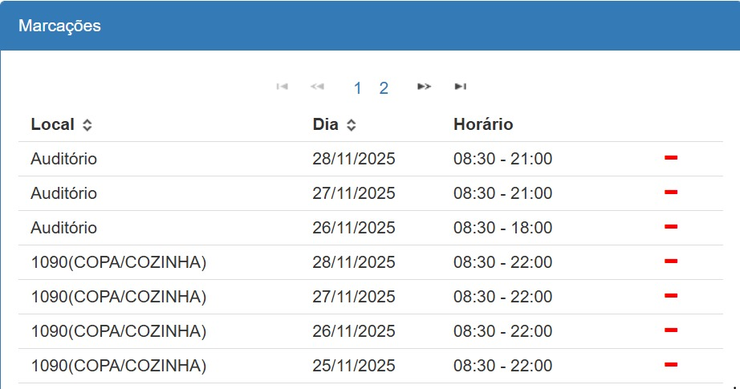

# Infraestrutura

**Informações da reserva:**

Reserva do Auditório:

Dia 26/11 - 8:30 às 18:00

Dias 27 e 28/11 - 8:30 às 21:00

Reserva do Hall Bambu:

Dia 26/11 - 8:30 às 19:00

Dias 27 e 28/11 - 8:30 às 22:00

Reserva da Copa/Cozinha:

Dias 25, 26, 27 e 28/11: 8:30 às 22:00

Capacidade: 400 pessoas

Reserva feita pela Profa. Maria Lúcia (contato no “Useful numbers”)

**Coisas a se conferir:**

Para a realização do evento é necessária a contratação de uma equipe de limpeza.

Ramal: 1008

Quantidade de crachás

**O que ainda deve ser feito:**

Definir qual computador será usado no dia

Solicitar a rede do congresso dia 19 de novembro (tem que ser a professora Maria Lucia): ti.eng.ufmg.br

**Sobre a estrutura do ambiente:**

Entrada do projetor: HDMI

N° de microfones: 3 sem fio + 1 no púlpito

N° de cadeiras: 6 na mesa + 1 no púlpito

**Tamanho mesas:**

Direita: 258,5 cm

Meio: 256 cm

Esquerda: 258,5 cm

Total: 781 cm

***Coisas para o dia:***

- [ ]  Adaptador HDMI para mac
    - Está no lab
- [ ]  Banner na entrada
- [ ]  Faixa no palanque
- [ ]  20 camisetas
- [ ]  Placas indicativas (copa, banheiro, auditório…)
- [ ]  Crachá da organização
- [ ]  Lembrancinhas (ecobag, caneta, bloquinho…)
- [ ]  Crachás dos participantes